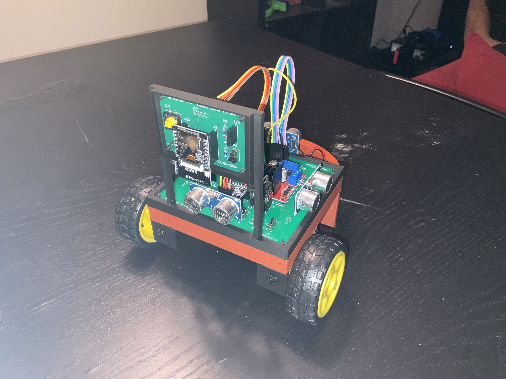

# DickerBot
*A lightweight ESP32-powered robotics platform for learning sensor integration and control through Python.*

## Table of Contents

1. [Background](#background)
2. [Introduction](#introduction)
3. [Getting Started](#getting-started)
    - [Demo](#demo)
    - [PCB Assembly Tips](#pcb-assembly-tips)
    - [Enclosure Assembly Tips](#enclosure-assembly-tips)
    - [Robot Code (DickerBotController & DickerBotCommunicator)](#robot-code-dickerbotcontroller--dickerbotcommunicator)
    - [Host Application (DickerBotHost)](#host-application-dickerbothost)
    - [Client Library (DickerBotClient)](#client-library-dickerbotclient)
4. [Known Limitations](#known-limitations)
5. [Why DickerBot?](#why-dickerbot)
    - [Cost](#cost)
6. [Contributing](#contributing)
7. [Acknowledgements](#acknowledgements)

## Background

DickerBot was born out of my love for robotics and a desire to make learning sensor integration more accessible. I noticed that most approaches required diving deep into complex systems like ROS or low-level embedded C — which, while powerful, could be overwhelming for beginners just trying to understand the basics.

At the time, I was heavily using the **ESP32** and was consistently impressed by how much you could do with such a cheap and small chip. I saw an opportunity: create a small robot with minimal hardware complexity, but powerful enough to teach core robotics concepts using **Python**.

## Introduction

**DickerBot** is a simple robot car built around the ESP32 that sends real-time data (IMU, distance sensor, and camera) to a host machine. The host runs a Python WebSocket server that receives this data and allows users to send control commands back. The focus is on **learning** how to work with sensor data in a higher-level environment without needing to deep-dive into embedded code or install large frameworks.

The inspiration for the robot’s name and initial design came from my professor, **Dr. Dickerson**, whose Cyber-Physical Systems class used similar hardware — but with a deeper focus on embedded systems and C. DickerBot aims to be *higher-level* to that approach.

## Getting Started

### Demo

Below is a basic demonstration of the DickerBot showcasing movement and sensor polling in real-time.

### PCB Assembly Tips

The DickerBot is split between two PCBs:

1. **Communicator**: Handles the ESP32-CAM
2. **Controller**: Handles the ESP32-WROOM, ultrasonic sensors, motors, motor controller, IMU, and power.

See the video below for some tips on the PCB assembly process.

You can download the latest release of the PCB from [here](https://github.com/keshavshankar08/DickerBot/releases). 

For images of the PCB and schmeatics, please refer to [images/](./images/).

### Enclosure Assembly Tips

The enclosure is very basic, using press fit inserts to joint all parts. The parts can be assembled as seen in the image below:

You can download the latest release of the enclosure from [here](https://github.com/keshavshankar08/DickerBot/releases). 

For images of the final assembled robot using the enclosure and PCB, please refer to [images/](./images/).

### Robot Code (DickerBotController & DickerBotCommunicator)

The robot code is split between two ESP32 WROOM microcontrollers:

1. **Communicator** (ESP32-CAM): Handles video streaming and sensor data transmission.
2. **Controller** (ESP32-WROOM): Manages motor control and hardware interactions.

For detailed documentation and demo videos, please refer to the [DickerBotCommunicator README](./DickerBotCommunicator/README.md) and [DickerBotController README](./DickerBotController/README.md).

### Host Application (DickerBotHost)

The host application is responsible for syncing Wi-Fi credentials and robot data between the computer and the robot. It also manages starting the WebSocket server, hosted on the computer, which allows a Python script to connect and communicate with the robot.

For detailed documentation and demo videos, please refer to the [DickerBotHost README](./DickerBotHost/README.md).

### Client Library (DickerBotClient)

This client library provides an interface for interacting with a socket-based system. It is designed to facilitate seamless communication and data exchange with the DickerBot service.

For detailed documentation and demo videos, please refer to the [DickerBotClient README](./DickerBotClient/README.md).

## Known Limitations

- Camera: 
  - Camera captures 96x96 grayscale images and transmits them serially, which is incredibly slow (currently ~10Hz).
    - Can be improved via JPEG compression and tweaking esp23-cam settings.
- PCB:
  - Header holes on Controller board are very low tolerance.
  - Molex connectors should be used for quick connections.

## Why DickerBot?

This is a platform for learning, not performance. The goal is to provide a **friendly, hackable entry point** into robotics using affordable hardware and intuitive Python code, hopefully inspiring others the same way this project inspired me.

### Cost

| Category | Cost       |
|--------|---------------|
| Componenets | $27.5 | 
| PCB | $10 |
| Enclosure | $3 |

## Contributing

DickerBot is an open-source project, and contributions are welcome! Whether it's reporting bugs, suggesting new features, or submitting pull requests for code updates, your input is highly valued. Feel free to open an issue or contribute directly by creating a pull request. Let's build and improve DickerBot together!

## Acknowledgements

This project would not have taken shape without the influence of [**Dr. Dickerson**](https://www.engineering.pitt.edu/people/faculty/samuel-dickerson/), whose teachings and guidance were instrumental in shaping the ideas behind DickerBot.