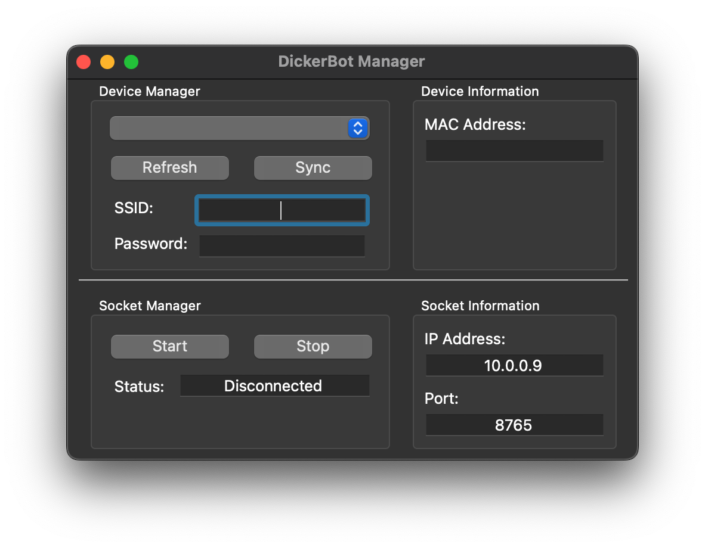

# DickerBot 🤖🚗  
*A lightweight ESP32-powered robotics platform for learning sensor integration and control through Python.*

## 📚 Background

DickerBot was born out of my love for robotics and a desire to make learning sensor integration more accessible. I noticed that most approaches required diving deep into complex systems like ROS or low-level embedded C — which, while powerful, could be overwhelming for beginners just trying to understand the basics.

At the time, I was heavily using the **ESP32** and was consistently impressed by how much you could do with such a cheap and small chip. I saw an opportunity: create a small robot with minimal hardware complexity, but powerful enough to teach core robotics concepts using **Python** and **WebSockets**.

## 💡 Introduction

**DickerBot** is a simple robot car built around the ESP32 that sends real-time data (IMU, distance sensor, and camera) to a host machine. The host runs a Python WebSocket server that receives this data and sends control commands back. The focus is on **learning** how to work with sensor data in a higher-level environment without needing to deep-dive into embedded code or install large frameworks.

The inspiration for the robot’s name and initial design came from my professor, **Dr. Dickerson**, whose Cyber-Physical Systems class used similar hardware — but with a deeper focus on embedded systems and C. DickerBot aims to be a *higher-level complement* to that approach.

## ⚙️ Getting Started

### PCB Assembly

(coming soon)

### Robot Code

The robot code is split between two ESP32 WROOM microcontrollers:

1. **Communicator** (ESP32-CAM): Handles video streaming and sensor data transmission.
2. **Controller** (ESP32-WROOM): Manages motor control and hardware interactions.

#### Setup Steps

1. **Download Libraries**  
    Get the required libraries from the `Releases` section.

2. **Add to Arduino IDE**  
    Import the libraries via `Sketch > Include Library > Add .ZIP Library...`.

3. **Load Example Code**  
    - **Communicator**: `File > Examples > DickerBotCommunicator > Communicator`
    - **Controller**: `File > Examples > DickerBotController > Controller`

4. **Select Board**  
    Set **ESP32 Dev Module** under `Tools > Board`.

5. **Upload Code**  
    - Flash **Communicator** code to the ESP32-CAM (Ensure you toggle the switch on the module to boot mode).
    - Flash **Controller** code to the ESP32-WROOM.

For detailed documentation, please refer to the [DickerBotCommunicator README](./DickerBotCommunicator/README.md) and [DickerBotController README](./DickerBotController/README.md).

Refer to the demo video below for a step-by-step guide:

(COMING SOON)

### Host Application

The host application is responsible for syncing Wi-Fi credentials and robot data between the computer and the robot. It also manages starting the WebSocket server, hosted on the computer, which allows a Python script to connect and communicate with the robot.

You can download the host application from the `Releases` section of this repository.

Below is an image of the host application's user interface:

#### UI Overview

1. **Device Manager**: Enter and sync your Wi-Fi credentials to a robot connected to your computer via a serial line.
2. **Device Information**: Information about the robot you have synced to.
3. **Socket Manager**: Start and stop the socket and view the connection status.
4. **Socket Information**: Information about the hosting information for the socket.

Refer to the demo video below for a step-by-step guide:

(COMING SOON)

### Client Library

This client library provides an interface for interacting with a socket-based system. It is designed to facilitate seamless communication and data exchange with the DickerBot service. For detailed documentation, please refer to the [DickerBotClient README](./DickerBotClient/README.md).

#### Installation
You can install the library using pip: `pip install dickerbotclient`

Refer to the demo video below for a step-by-step guide:

(COMING SOON)

## Acknowledgements
This project would not have taken shape without the influence of [**Dr. Dickerson**](https://www.engineering.pitt.edu/people/faculty/samuel-dickerson/), whose teachings and guidance were instrumental in shaping the ideas behind DickerBot.

## ⚠️ Known Limitations

- Camera frame rate is currently low (~10 FPS over WebSocket)

## Why DickerBot?

This is a platform for learning, not performance. The goal is to provide a **friendly, hackable entry point** into robotics using affordable hardware and intuitive Python code — and hopefully inspire others the same way this project inspired me.

## 🤝 Contributing

DickerBot is an open-source project, and contributions are welcome! Whether it's reporting bugs, suggesting new features, or submitting pull requests, your input is highly valued. Feel free to open an issue or contribute directly by creating a pull request. Let's build and improve DickerBot together!